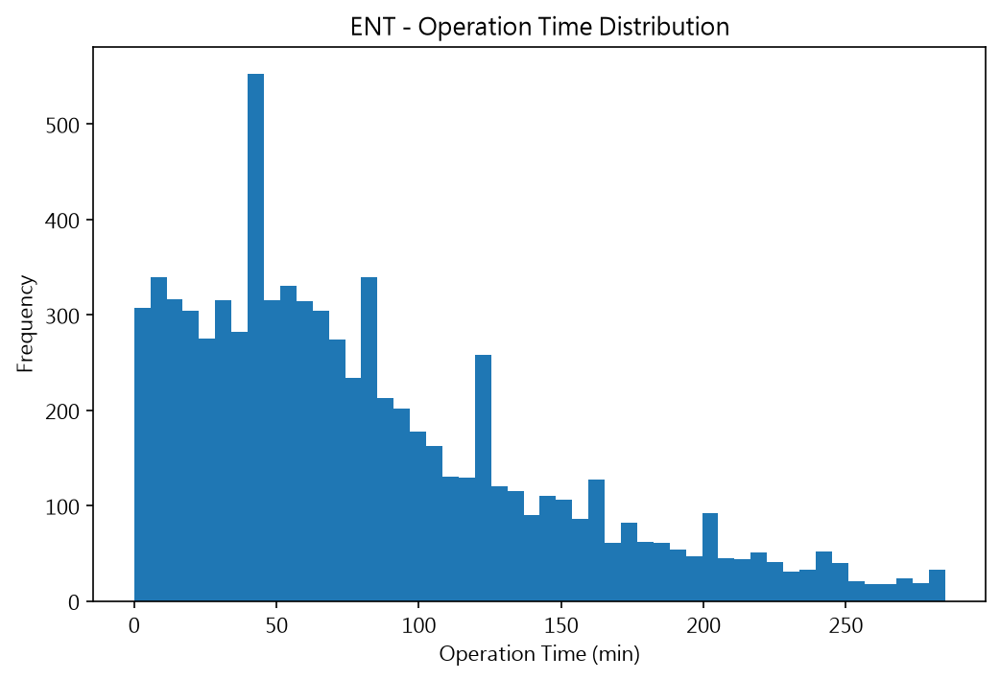
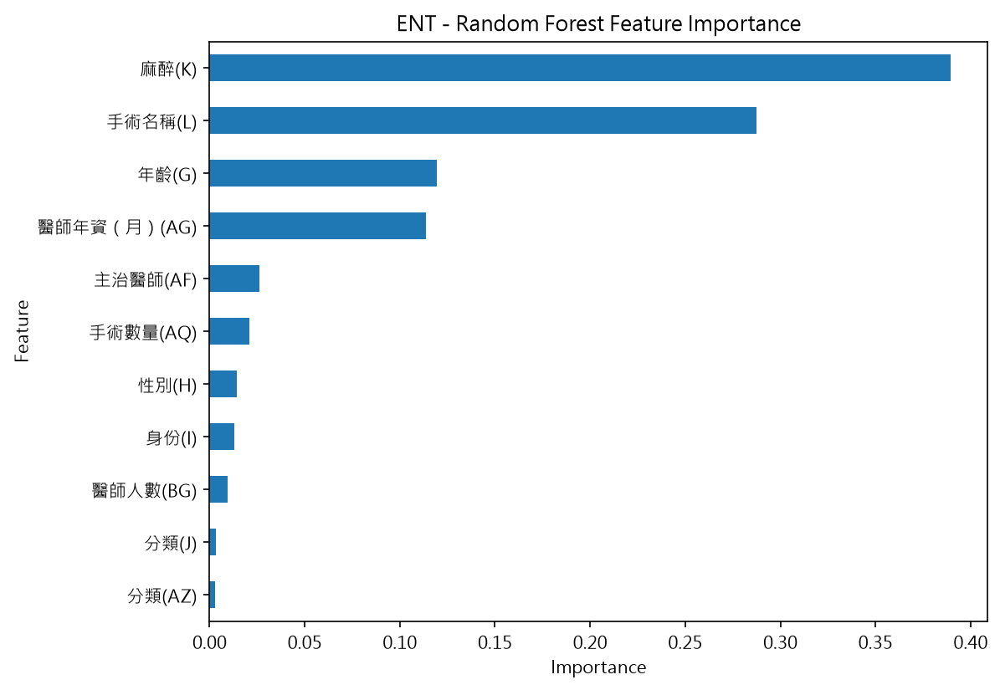
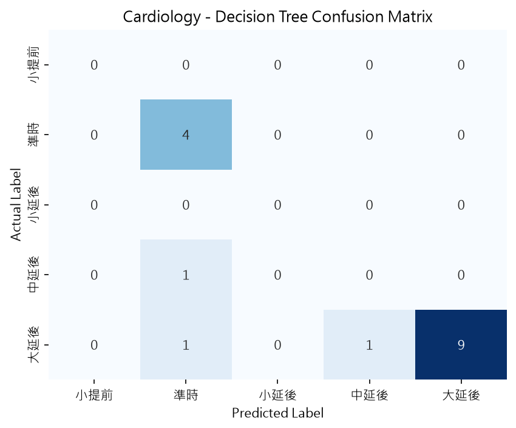

# 醫療時間預測：手術時間迴歸與門診延誤分類

以醫院營運資料為背景的兩個機器學習任務：**手術時間預測（迴歸）** 與 **門診看診延誤預測（分類）**。

個人獨立完成的端到端機器學習專案：統一 OOP pipeline、自動模型選擇、指標彙整與圖表輸出，並在迭代過程中發現並修正了三個實際 bug（見[工程筆記](#工程筆記迭代過程中發現並修正的問題)）。

## 專案亮點

- **8 個科別 × 5 種模型的系統性比較**：手術 5 科（ENT / GS / GU / OPH / ORTH，訓練資料共約 6.5 萬筆）、門診 3 科（心臟科 / 神經科 / 風濕免疫科）
- **統一的 OOP pipeline**：抽象基底類別定義 `load_data → preprocess → train → predict` 流程，迴歸與分類兩任務共用同一套骨架與模型選擇邏輯
- **自動模型選擇**：迴歸以驗證集 MAE、分類以驗證集 weighted F1 選出各科最佳模型，所有結果彙整至 `reports/metrics_*.csv`
- **可重現**：單一入口 `main.py`，一行指令重跑任一科別，圖表自動輸出至 `reports/figures/`

## Pipeline 架構


---

## 任務一：手術時間預測（迴歸）

### 問題

排刀高度仰賴人工估時：低估造成手術室超時、擠壓後續刀序；高估造成刀房閒置。此任務以術前即可取得的資訊預測手術時間（分鐘），作為排程輔助。

### 資料

5 個外科科別的手術紀錄（去識別化資料，醫師以「醫師N」代碼表示），每科 12 個欄位：

- 術前特徵：年齡、性別、身份、分類 ×2、麻醉方式、手術名稱、主治醫師、醫師年資（月）、手術數量、醫師人數
- 預測目標：手術時間（分）

| 科別 | 訓練筆數 | 測試筆數（無標籤） |
|---|---|---|
| ENT（耳鼻喉科） | 8,294 | 328 |
| GS（一般外科） | 11,638 | 974 |
| GU（泌尿科） | 7,853 | 167 |
| OPH（眼科） | 19,797 | 366 |
| ORTH（骨科） | 17,046 | 3,203 |

### 方法

1. 以 IQR 移除極端值；手術時間右偏（見下圖），目標取 log1p 訓練、還原為分鐘後計算誤差
2. 類別欄位 Label Encoding；推論期沿用訓練期映射，未知類別統一給保留碼、不位移既有編碼
3. 80/20 切分訓練/驗證集，比較 Decision Tree、Random Forest、SVR、KNN、XGBoost 五種模型；SVR 與 KNN 另比較 StandardScaler / MinMaxScaler 兩種縮放
4. 依驗證集 MAE 選出各科最佳模型，對無標籤的測試集產出預測（`outputs/{科別}_prediction.xlsx`）



### 結果

各科最佳模型（驗證集，誤差單位：分鐘）：

| 科別 | 最佳模型 | MAE (分) | RMSE (分) | R² |
|---|---|---|---|---|
| ENT | Random Forest | 28.04 | 40.71 | 0.559 |
| GS | XGBoost | 31.58 | 42.79 | 0.399 |
| GU | Random Forest | 30.81 | 43.01 | 0.533 |
| OPH | XGBoost | 11.70 | 16.70 | 0.508 |
| ORTH | XGBoost | 27.09 | 37.46 | 0.466 |

幾個跨科別一致的觀察：

- **集成樹模型全面勝出**：五科的最佳模型都是 Random Forest 或 XGBoost，且兩者差距很小（MAE 差 < 0.6 分）；單棵決策樹一致墊底，在 GS 甚至出現負的 R²（比直接猜平均值還差），顯示單樹在這批特徵上嚴重過擬合
- **手術類型本身決定時間**：特徵重要度由「麻醉方式」與「手術名稱」主導（ENT 兩者合計約 0.68、OPH 約 0.77），病患屬性（年齡、性別）與醫師因素（主治醫師、年資）是次要訊號
- **OPH（眼科）誤差明顯較小**（MAE 11.7 分 vs 其他科 27～32 分）：眼科手術時間短、分佈集中，本身變異就小
- **R² 約 0.4～0.56**：術前資訊能解釋約半數的時間變異；MAE 27～32 分的水準對「排刀順序與時段粗估」有參考價值，但不足以支撐精確到分鐘的排程，剩餘變異推測來自術中不可預期因素



<details>
<summary>展開：各科全部模型完整比較</summary>

#### ENT（耳鼻喉科）

| 模型 | MAE (分) | RMSE (分) | R² |
|---|---|---|---|
| Random Forest | 28.04 | 40.71 | 0.559 |
| XGBoost | 28.35 | 40.96 | 0.554 |
| SVM (StandardScaler) | 33.36 | 46.84 | 0.417 |
| SVM (MinMaxScaler) | 33.38 | 46.88 | 0.416 |
| KNN (MinMaxScaler) | 34.54 | 48.53 | 0.374 |
| KNN (StandardScaler) | 34.74 | 48.98 | 0.362 |
| Decision Tree | 37.68 | 55.05 | 0.194 |

#### GS（一般外科）

| 模型 | MAE (分) | RMSE (分) | R² |
|---|---|---|---|
| XGBoost | 31.58 | 42.79 | 0.399 |
| Random Forest | 31.99 | 43.06 | 0.391 |
| SVM (MinMaxScaler) | 35.59 | 48.00 | 0.243 |
| SVM (StandardScaler) | 35.61 | 47.89 | 0.247 |
| KNN (StandardScaler) | 35.83 | 48.43 | 0.230 |
| KNN (MinMaxScaler) | 36.01 | 48.82 | 0.217 |
| Decision Tree | 42.98 | 56.98 | -0.066 |

#### GU（泌尿科）

| 模型 | MAE (分) | RMSE (分) | R² |
|---|---|---|---|
| Random Forest | 30.81 | 43.01 | 0.533 |
| XGBoost | 31.08 | 43.19 | 0.530 |
| SVM (MinMaxScaler) | 39.30 | 54.52 | 0.250 |
| KNN (MinMaxScaler) | 39.70 | 55.37 | 0.227 |
| SVM (StandardScaler) | 40.01 | 55.48 | 0.224 |
| KNN (StandardScaler) | 40.42 | 56.67 | 0.190 |
| Decision Tree | 41.44 | 56.59 | 0.192 |

#### OPH（眼科）

| 模型 | MAE (分) | RMSE (分) | R² |
|---|---|---|---|
| XGBoost | 11.70 | 16.70 | 0.508 |
| Random Forest | 12.25 | 17.22 | 0.477 |
| KNN (MinMaxScaler) | 12.94 | 18.03 | 0.427 |
| SVM (StandardScaler) | 13.11 | 18.63 | 0.388 |
| SVM (MinMaxScaler) | 13.24 | 18.29 | 0.411 |
| KNN (StandardScaler) | 13.26 | 18.41 | 0.403 |
| Decision Tree | 15.83 | 21.90 | 0.155 |

#### ORTH（骨科）

| 模型 | MAE (分) | RMSE (分) | R² |
|---|---|---|---|
| XGBoost | 27.09 | 37.46 | 0.466 |
| Random Forest | 27.95 | 38.56 | 0.434 |
| KNN (MinMaxScaler) | 32.37 | 44.04 | 0.262 |
| SVM (StandardScaler) | 32.87 | 44.45 | 0.248 |
| SVM (MinMaxScaler) | 32.92 | 44.37 | 0.251 |
| KNN (StandardScaler) | 33.14 | 44.85 | 0.234 |
| Decision Tree | 36.26 | 49.75 | 0.058 |

</details>

---

## 任務二：門診延誤預測（分類）

### 問題

病患按預估時段報到，實際看診時間卻可能大幅提前或延後，現場等待體驗差。此任務以當日掛號進度預估實際看診時間的偏移程度。

### 資料與特徵工程

3 個內科門診的掛號紀錄（心臟科 107 筆、神經科 273 筆、風濕免疫科 291 筆），原始欄位僅有掛號與時間戳記資訊，特徵全部由衍生而來：

- **等待時間（分）** = 實際看診時間 − 預估看診時間（作為分級目標）
- **看診時間（分）** = 與下一位病患實際看診時間的差
- **當日累計看診人數**、**當日掛號總數**（現場進度資訊）
- 預測目標：等待時間分 7 級（大提前 < −100 分 … 準時 ±25 分 … 大延後 > +100 分）

### 方法

1. 依科別特性過濾離群值（各科等待/看診時間上下限不同，集中設定於 `main.py`）
2. 等待時間以固定級距分箱，使用 pandas 有序類別直接編碼，確保「編碼 → 級距 → 分鐘數」對應一致
3. 5 種模型均以 GridSearchCV（5-fold、weighted F1）調參，依驗證集 weighted F1 選出最佳模型

### 結果

| 科別 | 最佳模型 | Accuracy | F1 (weighted) | 驗證集筆數 |
|---|---|---|---|---|
| Cardiology（心臟科） | Decision Tree | 0.812 | 0.819 | 16 |
| Neurology（神經科） | Random Forest | 0.548 | 0.563 | 42 |
| Rheumatology（風濕免疫科） | SVM (MinMaxScaler) | 0.689 | 0.611 | 45 |

- **三科最佳模型各不相同**（Decision Tree / Random Forest / SVM），weighted F1 落在 0.56～0.82：小資料集上沒有單一贏家，逐科比較選模有其必要
- **數字需保守解讀**：三科驗證集僅 16 / 42 / 45 筆，單一樣本的翻轉就會讓指標明顯波動
- 以心臟科混淆矩陣為例，模型主要能抓住「準時 vs 大延後」的粗粒度差異；中間級距（小延後、中延後）樣本稀少，容易被相鄰類別吸收



範例推論（心臟科最佳模型）：預約 15:30、現場進度 25/50 人 → 預測「大延後」（+120 分），預估實際看診時間 17:30。

<details>
<summary>展開：各科全部模型完整比較</summary>

#### Cardiology（心臟科）

| 模型 | Accuracy | Precision | Recall | F1 |
|---|---|---|---|---|
| Decision Tree | 0.812 | 0.854 | 0.812 | 0.819 |
| SVM (StandardScaler) | 0.812 | 0.760 | 0.812 | 0.785 |
| Random Forest | 0.812 | 0.760 | 0.812 | 0.785 |
| KNN (MinMaxScaler) | 0.750 | 0.823 | 0.750 | 0.764 |
| KNN (StandardScaler) | 0.688 | 0.823 | 0.688 | 0.698 |
| SVM (MinMaxScaler) | 0.750 | 0.754 | 0.750 | 0.682 |
| XGBoost | 0.750 | 0.754 | 0.750 | 0.682 |

#### Neurology（神經科）

| 模型 | Accuracy | Precision | Recall | F1 |
|---|---|---|---|---|
| Random Forest | 0.548 | 0.655 | 0.548 | 0.563 |
| Decision Tree | 0.500 | 0.649 | 0.500 | 0.537 |
| XGBoost | 0.452 | 0.551 | 0.452 | 0.476 |
| KNN (MinMaxScaler) | 0.476 | 0.531 | 0.476 | 0.470 |
| KNN (StandardScaler) | 0.476 | 0.519 | 0.476 | 0.450 |
| SVM (MinMaxScaler) | 0.405 | 0.489 | 0.405 | 0.388 |
| SVM (StandardScaler) | 0.429 | 0.419 | 0.429 | 0.370 |

#### Rheumatology（風濕免疫科）

| 模型 | Accuracy | Precision | Recall | F1 |
|---|---|---|---|---|
| SVM (MinMaxScaler) | 0.689 | 0.575 | 0.689 | 0.611 |
| Random Forest | 0.644 | 0.588 | 0.644 | 0.607 |
| KNN (StandardScaler) | 0.600 | 0.573 | 0.600 | 0.585 |
| KNN (MinMaxScaler) | 0.622 | 0.532 | 0.622 | 0.569 |
| SVM (StandardScaler) | 0.600 | 0.519 | 0.600 | 0.546 |
| XGBoost | 0.533 | 0.523 | 0.533 | 0.527 |
| Decision Tree | 0.467 | 0.546 | 0.467 | 0.501 |

</details>

---

## 工程筆記：迭代過程中發現並修正的問題

重構過程中對舊版程式逐段驗證，找到三個會影響結果正確性的 bug，全部修正並留下驗證證據：

**1. 分類標籤映射錯位（7 碼中 5 碼錯誤）**

舊版以 `LabelEncoder` 編碼中文類別，再用寫死的字典把編碼還原成分鐘數，但 `LabelEncoder` 依 Unicode 排序，實際順序是：

```
['中延後', '中提前', '大延後', '大提前', '小延後', '小提前', '準時']
```

與字典假設的 `0=大提前 … 6=大延後` 有 5 碼錯位，例如編碼 0 實際是「中延後（+60 分）」，卻被還原成「大提前（−120 分）」。修正：改用 `pd.cut` 有序類別的 `cat.codes` 依語意順序編碼，映射以類別名稱為 key。

**2. 推論期未知類別造成整體編碼位移**

舊版在推論期把 `'unknown'` 加入類別清單後重新排序、重新編碼。`'unknown'`（U+0075）排在所有中文字（U+4E00 起）之前，導致訓練期的每個類別編碼整體 +1，推論輸入的特徵全部錯位。修正：沿用訓練期映射，未知類別統一指定保留碼 `len(classes)`。

**3. 跨科別欄位名稱後綴不一致**

五科手術 CSV 的欄位語意相同，但字母後綴不同（OPH 的分類欄是 `(AY)`、其他科是 `(AZ)`），寫死欄名的舊版在 OPH 直接 KeyError。修正：依語意名稱前綴動態解析欄位。

## 限制與可能的下一步

- **門診資料量小**：單科僅 107～291 筆，驗證集僅 16～45 筆，分類指標波動大，此任務定位為特徵工程與方法示範
- **輕微資訊洩漏**：離群值過濾與類別編碼在切分前於全資料上進行；更嚴謹的做法是包進 sklearn `Pipeline` 在交叉驗證折內處理
- **門診特徵含現場進度**（當日累計看診人數），適合看診當日的即時預估，不適用於前一日排程
- **隨機切分未考慮時間順序**：正式部署前應改用 time-based split 驗證
- 下一步方向：SHAP 值解釋個別預測、分位數迴歸為排程提供保守上界

## 專案結構

```
Medical_Time_Prediction/
├── main.py                  # 單一入口：python main.py {surgery|clinic|all} [科別]
├── requirements.txt
├── src/
│   ├── base_pipeline.py     # 抽象基底：run() 流程、縮放、模型選擇與儲存
│   ├── surgery_pipeline.py  # 手術時間迴歸
│   ├── clinic_pipeline.py   # 門診延誤分類
│   └── visualizer.py        # 圖表輸出（分佈、特徵重要度、混淆矩陣）
├── data/
│   ├── surgery/             # 5 科 × 訓練/測試 CSV（Big5 編碼）
│   └── clinic/              # 3 科掛號紀錄 xlsx
├── reports/
│   ├── figures/             # 執行時自動輸出的圖表
│   └── metrics_*.csv        # 科別 × 模型指標彙整（含 selected 欄）
└── outputs/                 # 模型 .joblib 與預測結果（不進版控）
```

## 重現方式

```bash
git clone https://github.com/terencechou1022/Medical_Time_Prediction.git
cd Medical_Time_Prediction
python -m venv venv
venv\Scripts\activate        # Windows；macOS/Linux 改用 source venv/bin/activate
pip install -r requirements.txt

python main.py all           # 跑全部 8 個科別
python main.py surgery ENT   # 或指定單一科別
python main.py clinic cardiology
```

完整執行 `python main.py all` 約 10 分鐘（實測 615 秒；8 科重訓，含門診 GridSearchCV，已開多核心 `n_jobs=-1`）。

> 注意：手術資料 CSV 為 Big5 編碼（程式已正確處理），GitHub 線上預覽顯示亂碼屬正常現象。
